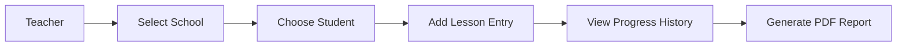
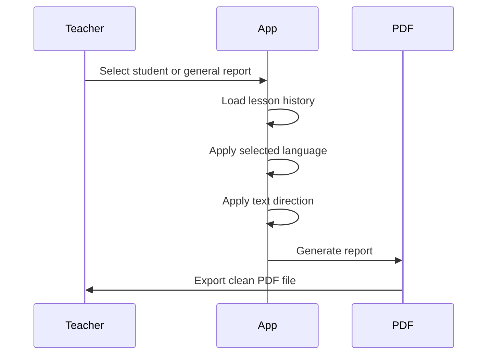

# 📖 Risale App


**Risale App** is a cross-platform **Flutter application** built for teachers to track students’ lesson progress in a simple, fast, and organized way.

The app helps teachers replace paper notebooks with a digital system for managing schools, students, daily lesson entries, progress history, and clean PDF reports.

It supports **Android** and **iOS**, and was designed for real daily use in a school environment.

---

## 📌 Overview

Risale App allows teachers to:

- Manage multiple schools
- Add and organize students
- Record daily lesson progress
- Track passed and not-passed lessons
- Add optional notes for each lesson
- Generate student-specific PDF reports
- Generate general PDF reports for all students
- Use the app in Arabic, Turkish, or English

The app is especially useful for teachers who need a fast and reliable way to follow student progress without carrying physical notebooks.

---

## 🎯 Project Purpose

The purpose of this project is to make student lesson tracking:

| Goal | Description |
|---|---|
| Faster | Teachers can log student progress in seconds |
| Cleaner | All records are stored digitally |
| Safer | Notes and progress history are saved inside the app |
| More Organized | Students are grouped by school |
| More Professional | Reports can be exported as PDF files |
| Multi-language | Arabic, Turkish, and English are supported |

---

## 🏗️ Tech Stack

| Layer | Technology |
|---|---|
| Framework | Flutter |
| Language | Dart |
| Platforms | Android, iOS |
| Reports | PDF generation |
| Localization | Flutter localization |
| Text Direction | RTL and LTR support |
| Main Use Case | Teacher lesson tracking |

---

## 🌍 Language Support

Risale App supports three languages:

| Language | Direction | Notes |
|---|---|---|
| Arabic | RTL | Default language |
| Turkish | LTR | Fully supported |
| English | LTR | Fully supported |

> [!NOTE]  
> The interface direction changes automatically depending on the selected language.

---

## ✨ Core Features

### 🏫 School Management

Teachers can manage more than one school inside the app.

| Feature | Description |
|---|---|
| Multiple schools | Add and manage different schools |
| Quick switching | Switch between schools anytime |
| Organized data | Students are grouped under their selected school |

---

### 👨‍🎓 Student Management

Teachers can add and manage students easily.

| Feature | Description |
|---|---|
| Add students | Create student profiles |
| Manage students | View and update student information |
| School-based grouping | Keep students organized by school |
| Progress tracking | View each student’s learning history |

---

### 📝 Lesson Entry Tracking

Teachers can record lesson progress for each student.

Each lesson entry can include:

- Lesson date
- Page learned
- Passed / not passed status
- Optional teacher note

| Field | Description |
|---|---|
| Date | The lesson entry date |
| Page Learned | The page or lesson section completed |
| Status | Passed or not passed |
| Note | Optional teacher comment |

---

## 📊 Progress History

Risale App stores student progress in a clear history format.

Teachers can use this history to:

- Review past lessons
- Check student improvement
- Identify repeated weak points
- Prepare reports for parents or school management
- Track daily learning activity

---

## 📄 PDF Reports

One of the main features of Risale App is PDF report generation.

### Report Types

| Report | Description |
|---|---|
| Student Report | Generates a PDF report for one selected student |
| General Report | Generates one PDF report containing all students |
| Daily Lessons Table | Included at the end of the general report |

---

### 👤 Student Report

The student report includes lesson history and progress for a single student.

Useful for:

- Parent meetings
- Individual progress tracking
- Teacher review
- Student performance analysis

---

### 🏫 General Report

The general report includes all students in one PDF file.

It also includes a **daily lessons history table** at the end, making it easier to review all classroom activity in one place.

---

## 🌐 PDF Language Support

PDF files are generated using proper fonts so that multilingual text renders correctly.

| Language | PDF Support |
|---|---|
| Arabic | Supported with correct RTL rendering |
| Turkish | Supported |
| English | Supported |

> [!IMPORTANT]  
> The PDF report language matches the currently selected app language.

---

## 🔤 Arabic Text Support

Risale App safely supports Arabic text in notes, reports, and interface labels.

This includes:

- Arabic notes
- Arabic student information
- Arabic report text
- Correct right-to-left layout
- Proper PDF rendering

---

## 📱 Download for Android

An Android release APK is included in this repository inside a `.rar` file.

### Installation Steps

1. Download the `.rar` file from this repository
2. Extract the `.rar` file
3. Install the APK on your Android phone

---

### Android Installation Warning

Android may show a warning about installing apps from unknown sources.

If needed, enable installation from unknown apps:

```text
Settings → Security/Privacy → Install unknown apps → Allow
```

Allow the browser or file manager app that you used to open the APK.

> [!WARNING]  
> Only install APK files from sources you trust.

---

## 🍎 Installing on iPhone

Apple does not allow direct APK-style installation on iPhone.

For personal testing, the easiest method is using **Xcode**.

> [!IMPORTANT]  
> A Mac is required for this method.

---

### iPhone Installation Requirements

| Requirement | Description |
|---|---|
| Mac | Required to run Xcode |
| Xcode | Installed from the App Store |
| iPhone | Connected by cable or paired wirelessly |
| Apple ID | Used for signing the app |
| Flutter SDK | Required if running from terminal |

---

### iPhone Installation Steps

1. Install **Xcode** from the Mac App Store
2. Open Xcode once after installation
3. On your iPhone, enable Developer Mode if requested:

```text
Settings → Privacy & Security → Developer Mode → ON
```

4. Connect your iPhone to your Mac
5. Open the iOS project:

```text
ios/Runner.xcworkspace
```

6. In Xcode:

```text
Runner → Signing & Capabilities → Team
```

7. Choose your Apple ID under **Team**
8. Make sure the Bundle Identifier is unique
9. Press **Run** in Xcode

---

### Alternative iPhone Run Command

You can also run the app from the terminal:

```bash
flutter run
```

---

### Trust Developer Certificate

After installing the app on iPhone, you may need to trust the developer certificate:

```text
Settings → General → VPN & Device Management → Trust Developer Certificate
```

> [!NOTE]  
> This method is for personal testing.  
> To share the app publicly on iOS, you need TestFlight or the App Store.

---

## 🚀 Running Locally

These steps are for developers who want to run the project from source.

---

### 1. Install Flutter

Make sure Flutter is installed on your system.

You can check your Flutter installation with:

```bash
flutter doctor
```

---

### 2. Install Dependencies

Run:

```bash
flutter pub get
```

---

### 3. Generate Localization Files

Run:

```bash
flutter gen-l10n
```

---

### 4. Run the App

Run:

```bash
flutter run
```

---

## 🧪 Developer Commands

| Command | Purpose |
|---|---|
| `flutter doctor` | Checks Flutter environment |
| `flutter pub get` | Installs dependencies |
| `flutter gen-l10n` | Generates localization files |
| `flutter run` | Runs the app |
| `flutter build apk` | Builds Android APK |
| `flutter build ios` | Builds iOS app |

---

## 🧠 Main Workflow



---

## 📂 App Workflow

### Daily Use

1. Open the app
2. Select the active school
3. Choose a student
4. Add a lesson entry
5. Mark the lesson as passed or not passed
6. Add a note if needed
7. Review progress history
8. Generate a PDF report when needed

---

## 📄 Report Workflow



---

## 🧩 Key Design Goals

| Goal | Explanation |
|---|---|
| Simple UI | Designed for quick daily use |
| Fast logging | Teachers can add entries without complexity |
| Clear history | Lesson progress is easy to review |
| Reliable reports | PDF output is clean and printable |
| Multi-language | Arabic, Turkish, and English users are supported |
| Real-world use | Built for actual school environments |

---

## 🛠️ Project Status

The project is complete and usable as a practical teacher lesson tracker.

Current status:

| Area | Status |
|---|---|
| Android support | Complete |
| iOS support | Available through Xcode |
| Multi-school support | Complete |
| Student tracking | Complete |
| Lesson history | Complete |
| PDF reports | Complete |
| Arabic / Turkish / English support | Complete |

---

## 🔮 Future Improvements

Possible future improvements include:

- Cloud backup
- Teacher account login
- Student search and filters
- Report sharing through WhatsApp or email
- More PDF customization options
- Dark mode
- Attendance tracking
- Parent view
- Web dashboard
- Automatic statistics and charts

---

## 🐞 Issues & Suggestions

If you find a bug or want to suggest an improvement, feel free to open an issue in this repository.

Helpful issue details include:

- Device model
- Android or iOS version
- App language
- Steps to reproduce the issue
- Screenshot if possible

---

## 📌 Notes

> [!NOTE]  
> Arabic is the default language of the app.

> [!TIP]  
> Use the currently selected app language before generating PDFs, because the report language follows the app language.

> [!WARNING]  
> iOS installation requires Xcode and is intended for personal testing unless the app is published through TestFlight or the App Store.

---

## 👨‍🏫 About

Risale App was created as a practical tool for teachers who need a simple and reliable way to track student learning progress without using paper notebooks.
